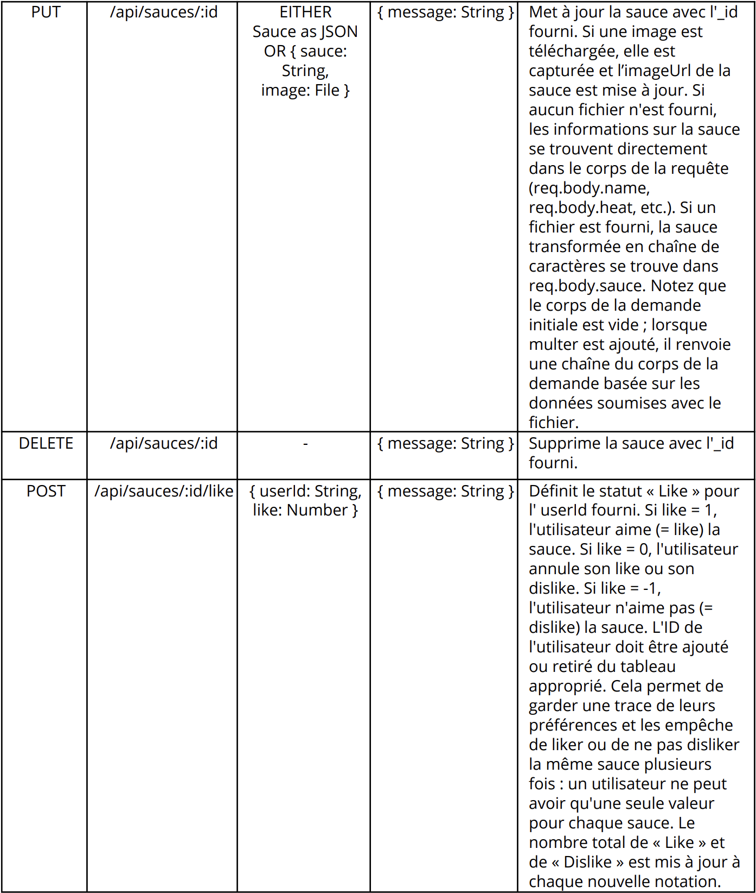

# Construisez une API sécurisée pour une application d'avis gastronomiques
Sixième projet du parcours dévelopeur web chez OpenClassrooms. L'objectif est de __développer le back-end d'une application web de critique des sauces piquantes__ appelée "Hot Takes".  

## Contexte du projet  

Votre nouveau client *Piiquante* se dédie à la création de sauces épicées dont les recettes sont gardées secrètes. Pour tirer parti de son succès et générer davantage de buzz, l'entreprise souhaite créer une application web de critique de sauce. L'application est une « galerie de sauces » permettant aux utilisateurs de télécharger leurs sauces piquantes préférées et de liker ou disliker les sauces que d'autres partagent.  

Le front-end de l'application a été développé à l'aide d'Angular et a été précompilé après des tests internes, mais Piiquante a besoin d'un développeur back-end pour construire l'API.  

Une attention particulière doit être portée aux exigences en matière de sécurité. L'entreprise a récemment été victimes d'attaques sur leur site web et veut être sûrs que l'API de cette application est construite selon des pratiques de code sécurisées.

[Lien vers le repo du projet](https://github.com/OpenClassrooms-Student-Center/Web-Developer-P6)  
  
    
## Spécifications de l'API  

  
  
  

## Data Models

### Sauce
- userId : String — l'identifiant MongoDB unique de l'utilisateur qui a créé la sauce.    
- name : String — nom de la sauce.    
- manufacturer : String — fabricant de la sauce.    
- description : String — description de la sauce.    
- mainPepper : String — le principal ingrédient épicé de la sauce.    
- imageUrl : String — l'URL de l'image de la sauce téléchargée par l'utilisateur.    
- heat : Number — nombre entre 1 et 10 décrivant la sauce.    
- likes : Number — nombre d'utilisateurs qui aiment (= likent) la sauce.    
- dislikes : Number — nombre d'utilisateurs qui n'aiment pas (= dislike) la sauce.    
- usersLiked : `[ "String <userId>" ]` — tableau des identifiants des utilisateurs qui ont aimé (= liked) la sauce.    
- usersDisliked : `[ "String <userId>" ]` — tableau des identifiants des utilisateurs qui n'ont pas aimé (= disliked) la sauce.    

### Utilisateur  
- email : String — adresse e-mail de l'utilisateur.   
- password : String — mot de passe de l'utilisateur.    

## Exigences de sécurité
- Le mot de passe de l'utilisateur doit être haché.  
- L'authentification doit être renforcée sur toutes les routes sauce requises.  
- Les adresses électroniques dans la base de données sont uniques et un plugin Mongoose approprié est utilisé pour garantir leur unicité et signaler les erreurs.  
-  La sécurité de la base de données MongoDB (à partir d'un service tel que MongoDB Atlas) ne doit pas empêcher l'application de se lancer sur la machine d'un utilisateur.  
- Un plugin Mongoose doit assurer la remontée des erreurs issues de la base de données.  
- Les versions les plus récentes des logiciels sont utilisées avec des correctifs de sécurité actualisés.  
- Le contenu du dossier images ne doit pas être téléchargé sur GitHub.  

